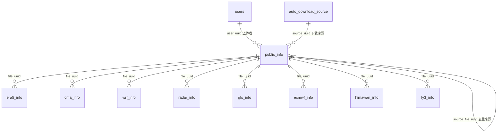

# 气象数据上传后端（backend_upload）

独立的 FastAPI 服务，负责前端上传页面的分片上传、断点续传、文件落盘和上传记录入库。

本服务只负责把原始文件可靠地接收到统一上传存储区，并在数据库中登记为“待解析”。Adapter 解析、WebP 生成和各数据类型明细入库由独立 Worker 执行，不阻塞上传请求。

数据库接入后，`public_info` 是待解析任务的唯一事实来源。上传文件不再按数据类型放入 `ERA5/wait_process`、`GFS/wait_process` 等目录，Worker 也不再通过扫描目录发现任务，而是查询 `parse_status=pending` 的记录并读取 `source_path`。

数据库设计以 [weather_database_schema_v2_auto_download.xlsx](../outputs/database_schema_auto_download/weather_database_schema_v2_auto_download.xlsx) 为准。README 说明开发约束和表之间的协作方式，字段类型、是否必填、默认值和索引的完整定义以 Excel 为准。

## 当前实现

当前代码已经完成第一版正式上传链路：

- `GET /api/upload/status`：按 JWT 用户隔离查询分片；完成后直接返回原任务，支持刷新和重复完成。
- `POST /api/upload/chunk`：幂等写入单个分片，校验分片索引、数量和大小。
- `POST /api/upload/complete`：加合并锁、顺序合并、计算 SHA-256、raw 落盘并写入 `public_info(parse_status=pending)`。
- `GET /api/upload/tasks`、`GET /api/upload/tasks/{file_uuid}`：返回当前用户的解析任务和状态。
- `POST /api/upload/tasks/{file_uuid}/retry`：将当前用户的失败任务重新入队。
- JWT 除角色外还查询共享 `users` 表，校验账号状态与 `token_version`。
- 相同用户、相同 `data_type`、相同 SHA-256 的文件使用硬链接复用 raw；原任务解析成功后，Worker 复用明细和 WebP 路径。

标准单文件类型已改为“只上传一次、数据库入队、Worker 异步解析”，前端不再把同一文件提交给 8002 的 `/api/files/parse`。FY-3 和 Himawari 仍保留现有 `/api/files/raw-upload`、`raw-scenes`、`update` 多文件场景流程，本版本不强制迁移，避免破坏文件配对逻辑。

当前标准单文件链路：

```text
前端分片上传
  -> backend_upload 合并、校验、计算 SHA-256
  -> 私有原始文件区
  -> public_info(ingest_status=success, parse_status=pending)
  -> Worker 从数据库领取任务
  -> Adapter 生成 meta/WebP 和明细资源
  -> public_info + 数据类型明细表事务更新
  -> 现有 /api/display/... 返回 WebP URL 给前端
```

## 目录结构

```text
backend_upload/
├─ main.py            # FastAPI 入口，默认端口 8003
├─ auth.py            # JWT 校验
├─ requirements.txt
├─ README.md
└─ tmp_chunks/        # 分片临时目录，运行时生成
```

当前实现已经把存储分为“私有原始文件区”和“可展示产物区”。原始文件按 `data_type` 进行运维分区，便于人工管理、统计和按类型清理；但任务发现、权限判断和 Adapter 选择始终以数据库字段为准，文件不再进入各类型的 `wait_process`。

```text
D:\weather_prediction_system\
├─ storage\                         # 不挂载为 /data 的私有存储根目录
│  ├─ tmp\uploads\{user_uuid}\{upload_session_id}\
│  ├─ tmp\adapter\{file_uuid}\{attempt_id}\
│  └─ raw\
│     ├─ user_upload\{user_uuid}\{data_type}\{yyyy}\{mm}\{file_uuid}\{file_uuid}.{ext}
│     └─ auto_download\{source_uuid}\{data_type}\{yyyy}\{mm}\{file_uuid}\{file_uuid}.{ext}
│
└─ backend\data\                   # 现有 /data 静态展示根目录
   └─ {data_type}\...               # meta、WebP、必要的可复用解析产物
```

原始文件目录示例：

```text
user_upload/99ac2fa0-78d0-4d4c-baa8-86f40831ac9b/ERA5/2026/07/
550e8400-e29b-41d4-a716-446655440000/
550e8400-e29b-41d4-a716-446655440000.nc
```

自动下载示例：

```text
auto_download/cds-era5/ERA5/2026/07/
550e8400-e29b-41d4-a716-446655440000/
550e8400-e29b-41d4-a716-446655440000.nc
```

目录中的 `{data_type}` 只能由后端根据白名单标准化后生成，例如 `ERA5`、`ECMWF`、`Radar`、`FY3`。它是物理归档标签，不是业务真相：Worker 不能扫描该目录领取任务，类型纠正也不能靠人工移动文件，必须由服务同时更新 `public_info.data_type` 与 `source_path`。

FY-3 和 Himawari 这类多文件场景使用 `collection_uuid` 作为共享文件夹，便于人工检查同一场景的配对或分段是否齐全：

```text
user_upload/{user_uuid}/FY3/{yyyy}/{mm}/{collection_uuid}/{file_uuid}.HDF
auto_download/{source_uuid}/Himawari/{yyyy}/{mm}/{collection_uuid}/{file_uuid}.DAT
```

Adapter 产物继续放在 `backend/data/{data_type}`，保证现有 `/data/...` WebP URL 和展示逻辑可以先保持不变。推荐新产物逐步收敛到：

```text
backend/data/{data_type}/assets/{file_uuid}/
├─ meta/meta.json
├─ webp/{element_key}/{resolution_key}/{level_key}/{frame_index}.webp
└─ parsed/                           # 仅保留后续数值计算确实需要的产物
```

Worker 已使用 Adapter 暂存目录兼容各数据类型现有输出方式，并在校验后统一发布到 `assets/{file_uuid}`。现有 meta 结构和 `/api/display/...` 响应不变，旧样例目录继续可读。

`public_info.source_path` 保存相对于 `RAW_STORAGE_ROOT` 的路径；`meta_path`、明细表的 `parsed_data_path` 保存相对于 `PRODUCT_DATA_ROOT` 的路径；`webp_url` 使用 `/data/...` URL。数据库不保存 Windows 绝对路径。原始文件路径不得返回前端。

旧版 `backend_upload/main.py` 使用的 `TYPE_TO_FOLDER + wait_process` 已移除。当前代码按“来源 + 所有者 + 标准化数据类型 + 日期 + file_uuid”生成 raw 路径，并使用以下配置：

```powershell
$env:RAW_STORAGE_ROOT = "D:\weather_prediction_system\storage\raw"
$env:TMP_STORAGE_ROOT = "D:\weather_prediction_system\storage\tmp"
$env:PRODUCT_DATA_ROOT = "D:\weather_prediction_system\backend\data"
```

`RAW_STORAGE_ROOT` 不得静态公开；`PRODUCT_DATA_ROOT` 继续服务 `/data`。临时分片、Adapter 中间文件均不应进入最终展示目录。解析失败时保留原始文件和错误信息，清理临时目录；解析成功后只保留原始文件、meta、WebP 和确有复用价值的解析产物。

## 启动

```powershell
cd D:\weather_prediction_system\backend_upload
python -m venv .venv
.\.venv\Scripts\Activate.ps1
pip install -r requirements.txt
python main.py
```

开发时也可以使用：

```powershell
uvicorn main:app --reload --host 127.0.0.1 --port 8003
```

接口文档：`http://127.0.0.1:8003/docs`

## 数据库关系



三层关系如下：

1. `users` 保存用户身份、角色和安全审计信息。
2. `public_info` 每个原始文件一行，统一登记用户上传、人工导入和系统自动下载文件，同时充当待解析任务队列。
3. 对应的数据类型明细表每个“要素/产品 × 层次 × 分辨率 × 时次 × WebP 资源”一行。一个 `file_uuid` 可以对应多行，不能给明细表的 `file_uuid` 加唯一约束。

## 表字段

### `users`

```text
id, uuid, username, password_hash, email, phone, real_name, organization,
role, status, create_time, update_time, last_login_time, last_login_ip,
password_changed_time, token_version, locked_until
```

上传服务重点使用 `uuid`、`role`、`status` 和 `token_version`。`password_hash` 只允许保存密码哈希，上传服务不得接触明文密码。

### `public_info`

```text
id, file_uuid, upload_session_id, user_uuid, source_uuid, collection_uuid, acquisition_type,
visibility, data_type, file_type, original_file_name, stored_file_name,
source_path, source_uri, file_size, file_hash, source_file_uuid,
ingest_status, parse_status, parse_attempts, next_parse_at,
parse_started_at, parse_finished_at, parse_error, parse_worker,
parse_lease_until, meta_path, default_webp_url, webp_count, adapter_name,
adapter_version, meta_schema_version, retention_until, is_pinned,
is_deleted, delete_time, deleted_by, delete_reason, download_count,
download_time, create_time, update_time, remark
```

关键字段职责：

| 字段组 | 作用 |
| --- | --- |
| `file_uuid` | 服务端生成的文件业务主键，贯穿原始文件、解析任务和明细资源。不能使用前端 `file_id` 代替。 |
| `upload_session_id` | `user_uuid + 前端 file_id` 的服务端 SHA-256，用于 `/complete` 幂等；它不是文件业务主键。该字段是实现幂等所需的技术补充。 |
| `user_uuid` / `source_uuid` | 用户上传时填写 `user_uuid`；自动下载时 `user_uuid` 为空并填写 `source_uuid`。 |
| `acquisition_type` / `visibility` | 区分 `user_upload`、`auto_download`、`manual_import`，以及 `private`、`public`、`organization`。 |
| 文件字段 | `source_path` 保存相对于 `RAW_STORAGE_ROOT` 的路径，`source_uri` 保存远端来源，`file_hash` 保存 SHA-256。 |
| `ingest_status` | 表示接收是否完成：`receiving`、`success`、`failed`。 |
| `parse_status` | 表示 Adapter 状态：`pending`、`running`、`success`、`failed`。 |
| 任务租约字段 | `parse_worker` 和 `parse_lease_until` 防止多个 Worker 重复解析同一文件。 |
| 解析结果摘要 | `meta_path`、`default_webp_url`、`webp_count` 便于列表和默认展示；完整资源在明细表。 |
| 软删除与保留 | `is_deleted`、删除审计字段、`retention_until` 和 `is_pinned` 支撑回收与滚动存储。 |

### `auto_download_source`

```text
id, source_uuid, source_name, data_type, provider, source_base_uri,
credential_ref, schedule_expression, enabled, retention_mode,
retention_days, retention_count, adapter_name, adapter_version,
target_visibility, target_directory, checkpoint_value, config_json,
last_run_at, last_success_at, next_run_at, last_error, create_time,
update_time, remark
```

该表只保存下载源配置、调度状态和滚动保留策略，不保存每次下载到的文件。每个下载文件仍写入 `public_info`，设置：

```text
user_uuid       = NULL
source_uuid     = 对应下载源
acquisition_type = auto_download
visibility      = public
parse_status    = pending
```

密码、Token 和访问密钥不得明文放在 `config_json`；`credential_ref` 应指向环境变量、密钥服务或受控配置项。

### 各数据类型明细表

所有明细表共享以下字段：

```text
id, asset_uuid, file_uuid, dataset_id, element_key, raw_element_name,
element_label, element_kind, raw_unit, display_unit, level_type,
level_value, valid_time, frame_index, resolution_key, grid_width,
grid_height, bbox_west, bbox_south, bbox_east, bbox_north,
parsed_data_path, webp_url, min_value, max_value, mean_value,
missing_ratio, is_default, asset_status, extra_json, create_time,
update_time
```

各表在公共字段后增加数据类型特有字段：

| 表 | 特有字段 |
| --- | --- |
| `era5_info` | `source_dataset`, `product_type`, `data_stream`, `step_type`, `grid_type`, `coordinate_system`, `native_lon_resolution`, `native_lat_resolution` |
| `cma_info` | `product_type`, `product_name`, `data_time`, `native_resolution_lon`, `native_resolution_lat` |
| `wrf_info` | `domain`, `forecast_reference_time`, `forecast_hour`, `dx_m`, `dy_m`, `source_resolution` |
| `radar_info` | `radar_name`, `station_code`, `radar_type`, `institution`, `product_code`, `observed_at`, `observed_end_at`, `elevation` |
| `gfs_info` | `run_time`, `cycle_hour`, `forecast_hour`, `step_type`, `type_of_level`, `product_category`, `interpolation_method` |
| `ecmwf_info` | `run_time`, `cycle_hour`, `forecast_hour`, `step_type`, `type_of_level`, `stream`, `product_class`, `interpolation_method` |
| `himawari_info` | `scene_id`, `satellite`, `region`, `band`, `wavelength`, `segment_index`, `total_segments`, `is_segment` |
| `fy3_info` | `scene_id`, `satellite`, `instrument`, `band`, `wavelength`, `source_resolution`, `file_role`, `paired_file_uuid` |

`element_key` 必须是系统稳定标识，例如 `t2m`、`u10`；`raw_element_name` 保留源文件原始名称；`element_label` 用于前端显示。查询单个气象要素的解析路径时，主要条件是 `data_type + element_key + valid_time + level + resolution_key`，返回 `webp_url` 或 `parsed_data_path`。

## 上传接口

统一响应壳：

```json
{"code": 0, "data": {}, "message": "success"}
```

### `GET /api/upload/status?file_id=...`

返回当前用户该文件已经接收的分片索引：

```json
{"code": 0, "data": {"uploaded": [0, 1, 2]}, "message": "success"}
```

### `POST /api/upload/chunk`

请求类型为 `multipart/form-data`，字段为 `file_id`、`chunk_index`、`total_chunks` 和二进制 `chunk`。`file_id` 只用于临时上传会话和断点续传，不是数据库中的 `file_uuid`。

### `POST /api/upload/complete`

请求类型为 `application/json`，字段为 `file_id`、`file_name`、`total_chunks`、`data_type`，可选 `collection_uuid`。响应包含：

```json
{
  "code": 0,
  "data": {
    "file_uuid": "550e8400-e29b-41d4-a716-446655440000",
    "file_name": "era5_t2m_20250610.nc",
    "data_type": "ERA5",
    "ingest_status": "success",
    "parse_status": "pending"
  },
  "message": "success"
}
```

原始文件的 `source_path` 只保存在数据库中，不通过上传接口返回前端。

`/complete` 必须具备幂等性。相同用户、相同上传会话重复请求时，应返回同一个已完成结果，不能再次覆盖文件或创建重复的 `public_info` 记录。

## 上传完成流程

推荐按以下顺序实现：

1. 从已经验证的 JWT 中取得 `user_uuid`，检查用户状态和上传权限。
2. 校验 `data_type`、扩展名、MIME、分片数量、分片大小和总文件大小。
3. 对同一 `user_uuid + file_id` 获取互斥锁，防止并发合并。
4. 按序合并到同目录临时文件，合并过程中计算 SHA-256，并校验最终大小。
5. 服务端生成 `file_uuid`，使用 `file_uuid` 组成 `stored_file_name`，禁止直接使用原文件名覆盖已有文件。
6. 检查 `file_hash` 去重策略，将临时文件原子移动到统一上传存储区。目标路径由 `user_uuid + 标准化 data_type + 日期 + file_uuid + 扩展名` 生成；`data_type` 仅作为可读的运维分区，数据库仍是权威来源。
7. 在事务中写入 `public_info`，设置 `ingest_status=success`、`parse_status=pending`。
8. 数据库提交成功后清理分片并返回成功；数据库失败时执行文件补偿清理或记录可恢复任务，不能向前端返回成功。

文件系统移动和数据库提交无法成为同一个原子事务。第一版至少要采用“临时文件 + 原子改名 + 数据库事务 + 失败补偿”，并提供定期扫描孤儿文件和失效分片的清理任务。

## 状态流转

```text
接收：receiving -> success
                -> failed

解析：pending -> running -> success
                    |      -> failed
                    +-- 租约过期后重试或恢复为 pending
```

解析 Worker 不扫描 `wait_process` 或其他数据目录。它应从数据库领取任务，并使用数据库条件更新实现抢占，例如仅将满足以下条件的记录改为 `running`：

```text
parse_status = pending
next_parse_at <= now
is_deleted = false
```

领取时同时写入 `parse_worker`、`parse_started_at` 和 `parse_lease_until`。不能先查询再无条件更新，否则多个 Worker 会重复处理。

只有在以下操作全部成功后才能设置 `parse_status=success`：

1. Adapter 完成并生成现有格式的 meta 文件和 WebP。
2. 对应的数据类型明细行全部写入或更新成功。
3. `public_info.meta_path`、`default_webp_url`、`webp_count`、Adapter 版本和结束时间更新成功。

明细行和 `public_info` 的成功状态应在同一数据库事务中提交。失败时写入 `parse_error`，增加 `parse_attempts`，按退避策略计算 `next_parse_at`。

## 后端改造方案

### 服务职责

| 模块 | 目标职责 | 不再承担的职责 |
| --- | --- | --- |
| `backend_upload`（8003） | 分片上传、校验、合并、SHA-256、原始文件落盘、`public_info` 入队 | 直接解析气象文件、按数据类型选择上传目录 |
| 解析 Worker | 领取 `pending` 任务、调用 Adapter、写 meta/WebP、写类型明细表 | 扫描 `wait_process` 发现任务 |
| 主后端（8002） | 展示查询、资源权限、保持 `/api/display/...` 兼容 | 接收同一个文件的第二次上传并同步解析 |
| 自动下载任务 | 下载原始文件、写入 `public_info`、执行滚动保留 | 将下载文件作为无记录的目录文件处理 |

### Adapter 改造边界

当前多数 Adapter 默认将 meta 和 WebP 写在原始文件旁边。目标是将“读取原始文件”和“写展示产物”分离，逐步统一为下列调用边界：

```python
process_file(source_path, output_root, data_type, context)
```

- `source_path`：来自 `RAW_STORAGE_ROOT` 的私有原始文件。
- `output_root`：`PRODUCT_DATA_ROOT/{data_type}`，用于写 meta、WebP 和可复用解析产物。
- `context`：至少包含 `file_uuid`、`collection_uuid`、解析尝试标识和来源信息。
- 返回值继续提供当前 meta 语义；不修改已有 meta 文件格式和版本。

ERA5、GFS、CMA、Radar、WRF 的气象解析算法可以复用，主要改造输入输出路径和产物命名。FY-3 与 Himawari 还需要处理多文件场景：每个物理文件各有一个 `file_uuid`，同一场景共享 `collection_uuid`；只有配对文件或分段文件完整时，Worker 才把该集合置为可解析。不能继续依靠扫描 `raw` 目录判断完整性。

### 展示兼容策略

第一阶段不直接重写所有展示接口。Worker 生成的 meta/WebP 仍写入现有展示根目录，并将路径登记到数据库；主后端继续返回既有 `/api/display/...` 响应字段：

```text
meta_json, webp, webp_files, variable_layers,
resolution_options, times, extent, weather_info
```

这样地图图层、逐帧播放和现有 meta 读取逻辑可以保持可用。第二阶段再将展示 Service 的“扫描最新目录”替换为数据库查询，但返回结构不得无故变更。

## WebP 与 meta 兼容

本次数据库接入不修改现有 meta 文件，也不替换现有展示接口。数据库是新增的索引层，前端仍按当前 `/api/display/...` 返回的相对 `/data/...` URL 读取 WebP。

解析入库代码必须兼容项目中已经存在的多版 meta 结构，至少包括：

```text
variable_layers.{element}.resolution_layers.{resolution}.webp_urls
variable_layers.{element}.webp_urls
variables[].webp.paths
webp_files / default_webp
```

入库时应遵守：

- `webp_url`、`default_webp_url` 使用 `/data/...` URL，不保存 Windows 绝对路径。
- `source_path` 保存相对于 `RAW_STORAGE_ROOT` 的原始文件路径；`meta_path`、`parsed_data_path` 保存相对于 `PRODUCT_DATA_ROOT` 的路径。
- `frame_index` 与 meta 中 WebP 列表顺序一致，`valid_time` 与同索引时间对应。
- 范围优先读取当前分辨率层的 extent，其次使用 meta 总体 extent/bbox。
- 无法映射但仍需保留的少量数据类型特有信息放入 `extra_json`，不能把高频查询字段全部塞入 JSON。
- 记录 `meta_schema_version` 和 `adapter_version`，但不能为了入库回写或升级旧 meta 文件。

数据库权限只控制“接口是否返回某个 WebP URL”。只要主后端仍将 `/data` 作为公开静态目录，知道 URL 的客户端仍可能直接访问私有文件。真正的私有数据隔离需要后续为静态资源增加鉴权、签名 URL 或受控下载接口。

## 前端改造方案

前端改造集中在上传页，不要求重做地图图层或 WebP 展示组件。当前标准文件在完成 8003 分片上传后，又把同一个浏览器 `File` 提交到 8002 的 `/api/files/parse`；数据库方案必须删除这次重复上传。

目标交互：

```text
选择文件 -> 分片上传 -> 返回 file_uuid / parse_status=pending
         -> 轮询文件或集合状态 -> running -> success / failed
         -> success 后刷新或跳转到既有展示页
```

### 上传 API 契约

`POST /api/upload/complete` 的成功响应必须提供 `file_uuid`、`collection_uuid`、`ingest_status`、`parse_status`。前端不提交可信的 `user_uuid`、路径或 Adapter 名称。

建议新增以下只读状态接口，具体路由可以在实现时统一，但响应语义必须稳定：

| 接口能力 | 前端用途 | 最少返回字段 |
| --- | --- | --- |
| 单文件状态 | 轮询普通文件的解析进度 | `file_uuid`, `ingest_status`, `parse_status`, `parse_error`, `default_webp_url` |
| 我的上传列表 | 展示当前用户的历史上传、失败和待处理任务 | `file_uuid`, `original_file_name`, `data_type`, `create_time`, `parse_status` |
| 场景/集合状态 | FY-3、Himawari 判断配对或分段文件是否齐全 | `collection_uuid`, `expected_count`, `received_count`, `ready_to_parse`, `parse_status` |

轮询只在 `pending`、`running` 状态期间进行；`success`、`failed`、用户离开页面后停止。失败状态必须展示 `parse_error` 的用户可读摘要，并提供重试入口；重试由后端重置任务状态，前端不重复上传原文件。

### 上传页改造

- 保留当前分片上传、断点续传和进度条。
- `/complete` 返回成功后，把页面状态设置为“已上传，等待解析”，不再调用 `/api/files/parse` 二次上传。
- 将现有“上传、解析、渲染 WebP、前端展示”步骤改为后端真实状态：`receiving`、`pending`、`running`、`success`、`failed`。
- 解析成功后使用 `default_webp_url` 或刷新现有展示接口；解析未完成时不得把上传完成误标为“可展示”。
- 上传结果和列表主键使用 `file_uuid`，不能使用浏览器生成的 `file_id` 或本地文件名。

### FY-3 与 Himawari

当前前端对 FY-3 和 Himawari 使用 `raw-upload`、`raw-scenes`、`update`，并把目录扫描结果展示为待解析队列。数据库方案下改为：

- 多个物理文件分别上传，每个文件取得一个 `file_uuid`。
- 前端或后端根据文件名规则归入同一个 `collection_uuid`；后端是最终裁决者。
- 页面显示集合的“已收到数量、缺少角色/波段、是否可解析、解析状态”，不展示服务器 `raw_dir`。
- 当集合完整时由 Worker 自动解析；前端不再手动调用目录扫描或 `update` 接口。

### 展示前端兼容要求

地图图层继续使用 `/api/display/...` 返回的 `meta_json`、`webp`、`webp_files`、变量层和时次信息，并继续使用 `/data/...` URL 加载 WebP。因此只要主后端保持该响应形状，ERA5、CMA、GFS、ECMWF、WRF、Radar、FY-3、Himawari 的展示组件不需要因数据库接入而重写。

若以后直接让前端查询明细表资源，应新增版本化资源接口，不能让前端拼接磁盘路径或直接依赖表名。这个改造应放在展示 Service 数据库化之后，而不是与上传队列改造同时进行。

## 去重规则

原始文件使用 SHA-256 去重，不能使用文件名、文件大小、修改时间或前端 `file_id` 作为内容相同的判断依据。

第一版建议采用以下边界：

- 同一用户上传相同 `data_type + file_hash`：保留一份物理文件；新记录可通过 `source_file_uuid` 指向已存在记录，且不重复解析。
- 自动下载的公共文件出现相同 `data_type + file_hash`：复用公共资源并更新时间或来源状态，不重复解析。
- 不同用户的私有上传：可以检测重复，但在权限模型完善前不要直接让一个用户引用另一个用户的私有记录或路径，以免泄露文件是否存在及访问权限。
- `is_deleted=true` 的记录是否参与复用必须由恢复和保留策略决定，不能无条件复用。

去重只解决内容一致，不替代上传完成接口的幂等控制。

## 权限与用户身份

- 前端不得提交可信的 `user_uuid`。后端必须从 JWT 中读取，并写入 `public_info.user_uuid`。
- `auth.py` 已把共享用户记录和 JWT claims 写入 `request.state`；业务代码只从该状态取得可信 `user_uuid`。
- 当前角色比较按数字进行，必须与 `users.role` 和认证服务的 Token 结构统一，避免字符串角色与数字阈值混用。
- 分片目录必须按 `user_uuid + safe_file_id` 隔离，`status`、`chunk` 和 `complete` 都要校验同一用户，不能只使用 `file_id` 的 MD5。
- `visibility=private` 的用户上传只能由所有者或具备管理权限的角色查询；自动下载数据默认 `visibility=public`。
- 删除使用软删除并记录 `deleted_by`、`delete_time` 和 `delete_reason`；物理清理由独立任务执行。

## 数据类型与明细表映射

`data_type` 用于选择 Adapter、校验文件和确定明细表，也作为原始文件的受控运维目录层级。目录中的类型值必须与数据库保持一致，但数据库字段才是权威来源。最终数据库分别使用独立的 GFS 和 ECMWF 明细表，并增加 FY-3：

| API `data_type` | Adapter/展示类型 | 明细表 |
| --- | --- | --- |
| `ERA5` | `ERA5` | `era5_info` |
| `CMA` | `CMA` | `cma_info` |
| `WRF` | `WRF` | `wrf_info` |
| `Radar` / `雷达` | `Radar` | `radar_info` |
| `GFS` | `GFS` | `gfs_info` |
| `ECMWF` | `ECMWF` | `ecmwf_info` |
| `Himawari` / `葵花` | `Himawari` | `himawari_info` |
| `FY3` / `FY-3` | `FY3` | `fy3_info` |

当前代码使用标准化数据类型生成 raw 运维分区，不再写入 `wait_process`，也不通过目录扫描推断类型或任务状态。前端必须明确选择 `GFS` 或 `ECMWF`；旧值只能作为过渡兼容输入，不能仅凭扩展名猜测。

## 索引与约束

建表时除 Excel 中列出的主外键和唯一约束外，应重点保证以下查询可使用索引：

```text
users(uuid), users(username), users(email)
public_info(file_uuid)
public_info(user_uuid, create_time)
public_info(source_uuid, create_time)
public_info(parse_status, next_parse_at, parse_lease_until)
public_info(data_type, visibility, is_deleted, create_time)
public_info(data_type, file_hash, is_deleted)
各明细表(file_uuid)
各明细表(element_key, valid_time, resolution_key)
各明细表(dataset_id, valid_time)
```

外键删除策略应显式定义。生产环境不建议级联物理删除气象资源；优先软删除 `public_info`，再由受控清理任务删除明细记录和磁盘文件。

## 开发注意事项

### 上传安全

- `data_type` 只能经过服务端白名单标准化，用于选择 Adapter、明细表和 raw 运维分区；客户端不能直接提供目录片段或任意类型名称。
- 使用 `Path(file_name).name` 只能去掉目录，仍需校验控制字符、保留名、扩展名和长度。
- 所有目标路径 `resolve()` 后必须确认仍位于配置的数据根目录内。
- 设置单分片大小、总文件大小、并发数、用户配额和临时目录磁盘水位限制。
- 保存分片前校验 `chunk_index`、`total_chunks` 及同一上传会话元数据一致性。
- 不信任浏览器 MIME；结合扩展名、文件头和 Adapter 能力进行校验。

### 并发、恢复和清理

- 同一上传只能有一个合并任务，进程内锁不足以支持多实例部署，应使用数据库锁或分布式锁。
- 分片先写 `.tmp` 再原子改名，合并文件先写 `.merging` 再原子改名。
- 服务重启后应能从临时目录恢复上传状态；临时会话至少保存用户、文件名、大小、分片数、类型和更新时间。
- 定时清理超时分片、失败合并文件、数据库不存在的孤儿文件，以及已过期且未固定的自动下载数据。
- 自动下载滚动删除前必须检查 `is_pinned`，并按 `retention_days` 或 `retention_count` 处理。

### 数据库与 Adapter

- 上传请求内不直接运行 Adapter，避免大文件解析占满 Web 进程和请求超时。
- Worker 必须查询 `public_info.parse_status=pending` 领取任务，根据 `source_path` 读取原始文件，再根据 `data_type` 选择固定 Adapter 和固定明细表；不能扫描目录发现任务，也不能使用客户端传入的任意模块名或表名。
- Adapter 必须把 `source_path` 与 `output_root` 分离：原始文件保持在私有根目录，meta/WebP 写入展示产物根目录；不得再默认把产物写在原始文件旁边。
- Adapter 先写入 `TMP_STORAGE_ROOT/adapter/{file_uuid}/{attempt_id}`，验证成功后再原子移动到最终产物目录，避免前端读取到半成品 WebP 或半写入 meta。
- 第一阶段允许保留当前各数据类型的展示产物目录结构；目录统一为 `assets/{file_uuid}` 前，必须先确认所有展示 Service 不再依赖顶层 glob 扫描。
- SQL 中的表名、排序字段和筛选字段使用后端白名单；Agent 只能生成结构化查询意图，不能把任意 SQL 直接交给数据库执行。
- 明细批量写入应使用事务和批处理；重试时按 `asset_uuid` 或稳定业务组合键执行 upsert，避免重复帧。
- `extra_json` 只保存低频扩展信息，Agent 常用的要素、时次、层次、分辨率和路径必须保留为结构化列。
- 所有时间统一保存为带时区时间；气象有效时间、起报时间和系统创建时间不能混用。

### 查询与展示

- 列表接口必须分页并设置最大页大小；Agent 查询必须限制行数、字段和时间范围。
- 查询结果过多时返回总量、截断标记和下一页游标，不把全部明细发送给 LLM。
- 逐帧播放按 `valid_time, frame_index` 稳定排序，不能依赖数据库默认顺序。
- 默认展示优先使用 `public_info.default_webp_url`；切换要素、层次或分辨率时查询对应明细表。
- `asset_status=ready` 且文件真实存在的资源才允许返回；定期检测数据库路径和磁盘文件是否一致。

## 实施状态

第一版已完成共享表初始化和旧用户迁移、标准单文件 raw 落盘、SHA-256、上传幂等、同用户内容去重、`public_info` 入队、单并发 Worker、明细入库、前端状态轮询和现有展示响应兼容。

当前保留的兼容边界：

1. 8002 的 `/api/files/parse` 仍可用于旧调用或调试，但正式上传页面不再调用。
2. FY-3、Himawari 继续使用原多文件 raw 场景流程；Himawari 不进入本版 Worker。
3. 展示 Service 已能扫描 `assets/{file_uuid}`，但返回结构仍来自 meta；后续再逐步切换为数据库优先查询。
4. 自动下载、滚动保留、组织权限、配额、清理和监控仍属于下一阶段。

本版已验证：分片上传、重复完成、真实 GFS 多要素多时次解析、任务失败回退、同内容 raw/解析结果复用、单 Worker 锁、明细路径入库和前端生产构建。生产上线前仍需补充并发压测、Worker 崩溃恢复演练和各数据类型样例回归。
